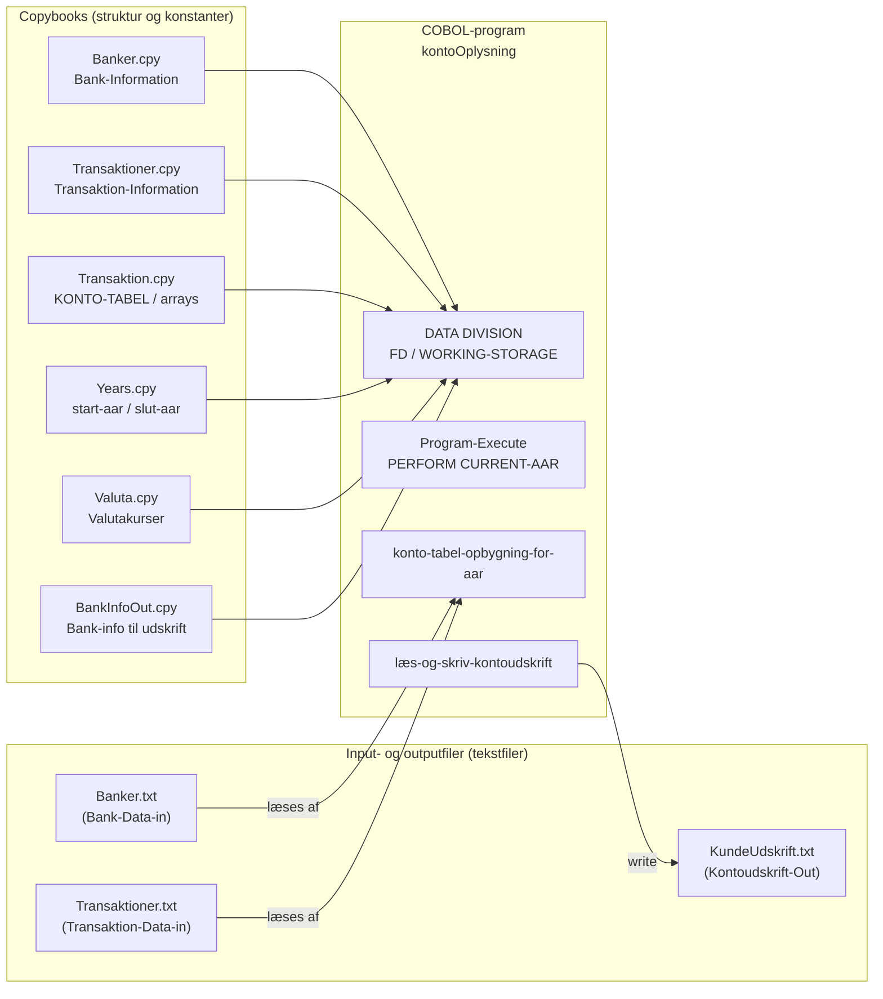
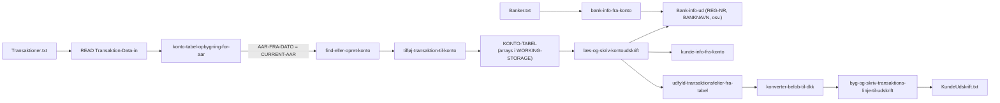
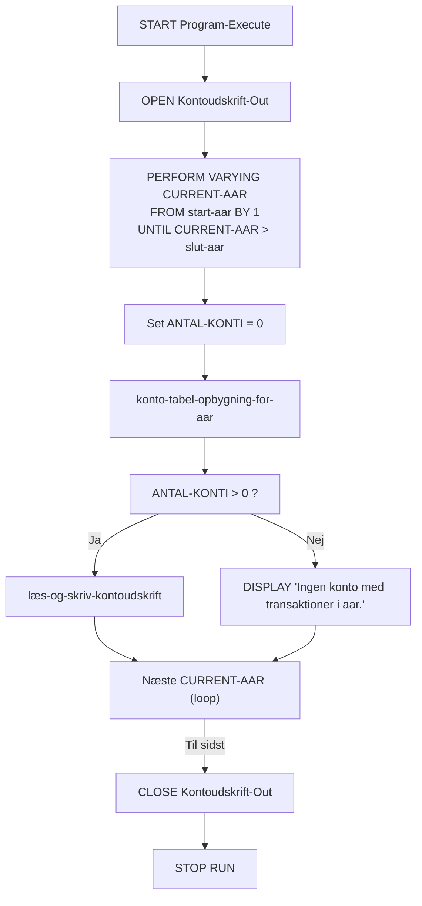
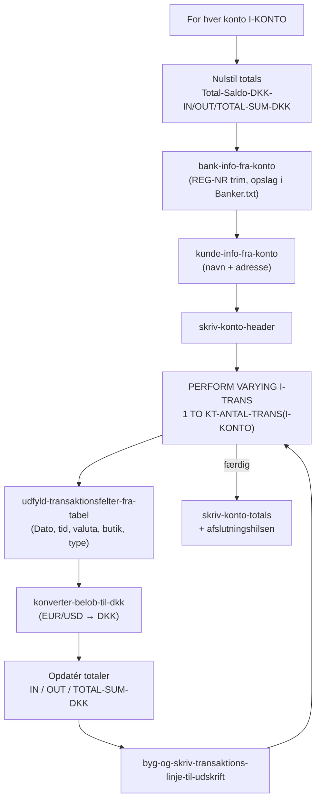
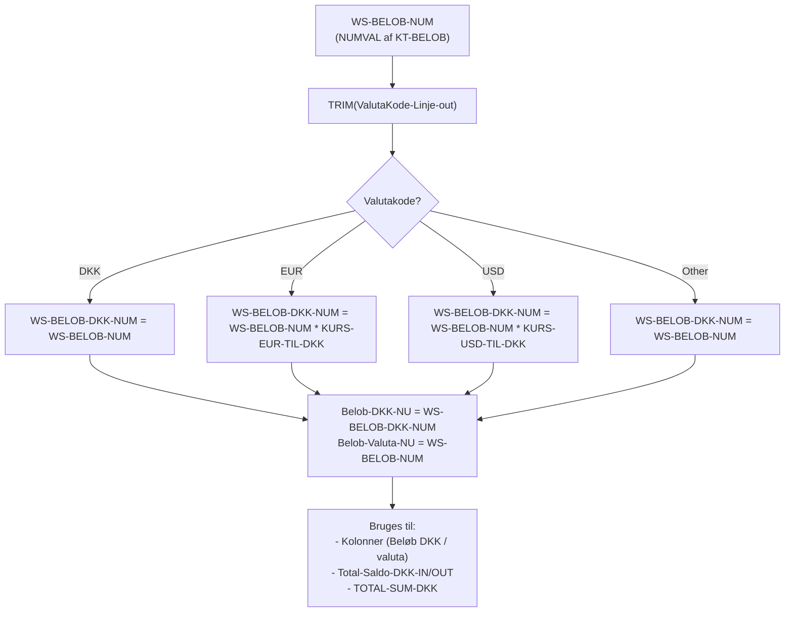
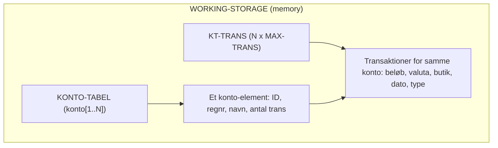

## 1️⃣ System / opsætning (filer ↔ COBOL-program)

**Formål:** Bruges tidligt i præsentationen til at vise “hvad består systemet af?”.

---

## 2️⃣ Dataflow – fra filer til kontoudskrift

**Formål:** Vise hvordan data flytter sig igennem programmet.

---

## 3️⃣ Processflow pr. år (øverst i Program-Execute)

**Formål:** Vise “hvad sker der, når programmet kører?” – godt overblik-slide.

---

## 4️⃣ Detaljeret konto/transactions-flow

**Formål:** Slide der zoomer ind i “hvad sker der for én konto?”, kan kobles til din performance-snak og valuta-håndtering.

---

## 5️⃣ Valuta-konverterings-flow (fremhæver både logik og fejlmulighed)

**Formål:** Bruges i delen hvor du taler om problemer med felter/char-opsætning og hvor én kolonne for lidt gav fejl.

---

## 6️⃣ Simpelt diagram over konto-tabel (arrays)

**Formål:** Understreger din pointe om “effektive arrays, lidt overhead, simpelt layout”.

