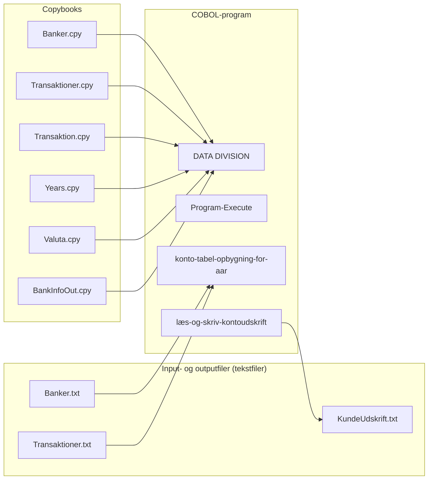
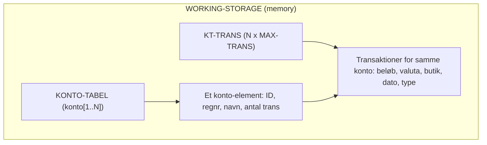
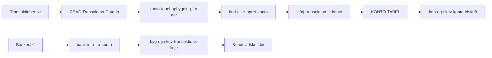
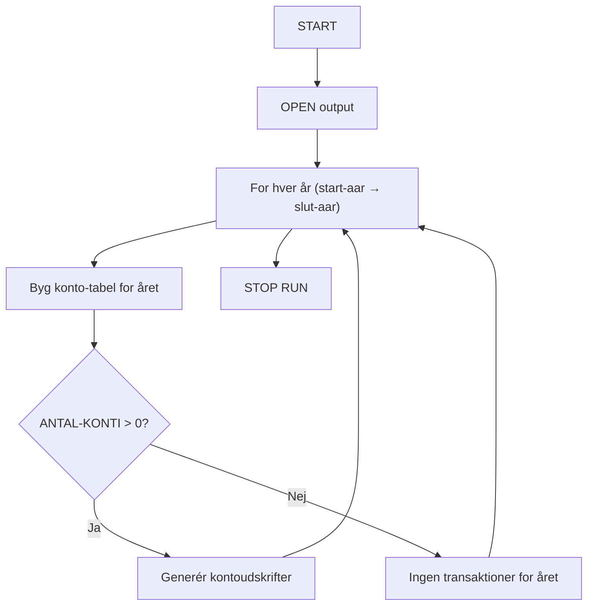
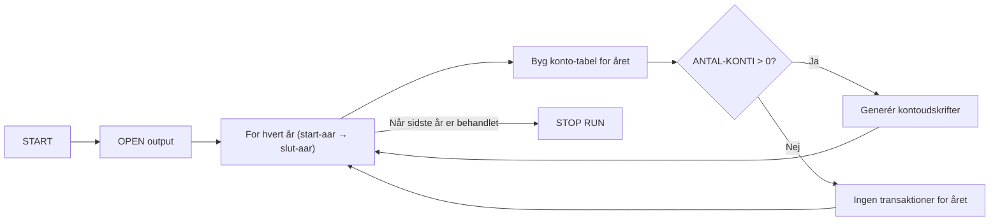
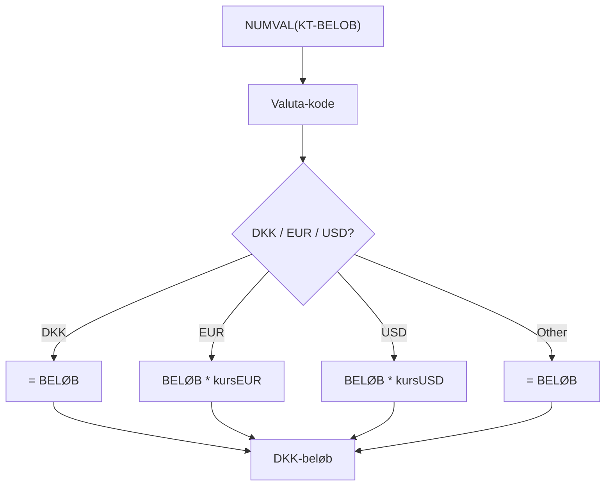

# **📄 Slide 1 — Titel + Indholdsfortegnelse**

### **Titel:**

**COBOL – Erfaringer, udfordringer og resultater fra 2 ugers arbejde**

### **Navn:**

John Høeg

### **Indhold (bullet points):**

* Kort intro til projektet
* Hvad jeg kan lide ved COBOL
* Hvad der giver problemer
* Dataflow i mit projekt
* Tekniske begrænsninger
* Performance-resultater
* Konklusion

*(Ingen diagram her – rent intro.)*

---

# **📄 Slide 2 — Projektets kontekst**

### **Formål med projektet**

* Parse 55.000+ transaktioner
* Sortere dem efter bankkonto og år
* Generere kontoudskrifter
* Håndtere valuta, bankdata og filinput

### **Diagram (system overview)**

Indsæt dette diagram som billede:

**System / opsætnings-diagram**

---

# **📄 Slide 3 — Hvad jeg kan lide ved COBOL**

### **Positive ting**

* **Utrolig effektivt** med store datamængder (55k records på ~15 sekunder)
* **Arrays i WORKING-STORAGE er ekstremt hurtige**
* **Ingen kompleks syntaks** → let at læse
* Næsten **intet runtime-overhead**
* Meget deterministisk: “maskine-opførsel” i stedet for magi

### **Diagram: Konto-array struktur**

*(Viser hvor simpelt og effektivt data ligger i memory.)*

---

# **📄 Slide 4 — Hvad jeg ikke kan lide**

### **Ulemper og frustrationspunkter**

* **Alt er fixed-width** → fejl, hvis 1 tegn er forkert
* Ingen dynamiske arrays
* Copybooks bliver hurtigt uoverskuelige
* Der er **80-tegns linjegrænse** i klassisk COBOL
* String-håndtering er smertefuld
* Debugging kræver meget print debugging

### Eksempel på konkret problem:

* Ét enkelt tal for lidt i **Beløb-feltet** ødelagde valutaomregningen totalt.

*(Her kan du vise et før/efter screenshot.)*

---

# **📄 Slide 5 — Dataflow i projektet**

### **Viser hele pipeline fra filer til output**

---

# **📄 Slide 6 — Processflow pr. år**

### **Sådan arbejder programmet internt**

---

# **📄 Slide 7 — Valuta-konvertering (teknisk udfordring)**

### Hvorfor dette var svært:

* Fixed width felter → *valuta sad nogle gange off-by-one*
* NUMVAL fejlede hvis beløbet var off alignment
* Konvertering misviste totals, hvis DKK og EUR ikke linede op

### Diagram:

---

# **📄 Slide 8 — Konklusion**

### Det vigtigste jeg har lært:

* COBOL er **simpelt men stærkt**, lige så hurtigt som C når alt ligger i memory
* Fixed-width + ingen dynamik = mange fejlmuligheder
* Men meget deterministisk og stabilt
* Copybooks giver struktur, men gør projektet tungt
* God oplevelse at prøve et sprog hvor *intet er magi*, alt er synligt

### Afslutning

* Projektet håndterede **55.000 transaktioner på ~15 sekunder**
* Fik bygget et fuldt kontoudskriftssystem med valuta, bankdata og årsfiltrering
